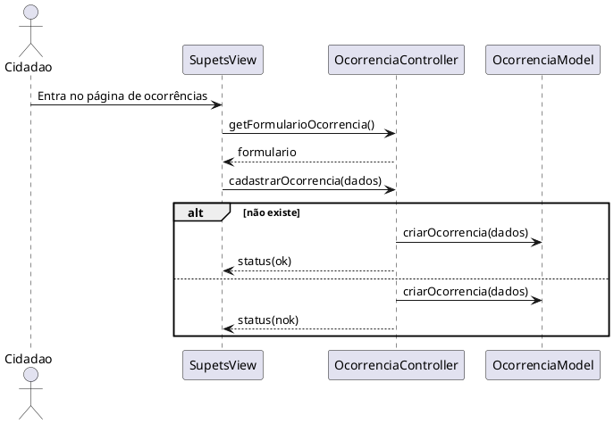
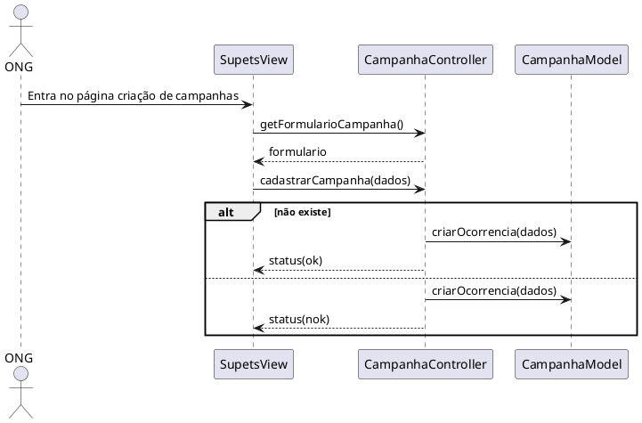
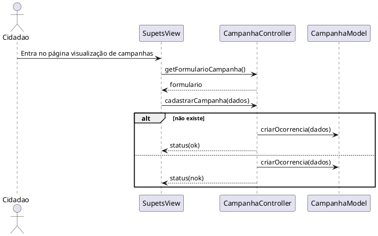

# Diagrama de Sequência

## Registrar ocorrência

```plantuml
@startuml
skinparam Shadowing false

actor Cidadao 

Cidadao -> SupetsView: Entra no página de ocorrências
SupetsView -> OcorrenciaController: getFormularioOcorrencia()
OcorrenciaController --> SupetsView: formulario
SupetsView -> OcorrenciaController: cadastrarOcorrencia(dados)

alt não existe
OcorrenciaController -> OcorrenciaModel: criarOcorrencia(dados)
OcorrenciaController --> SupetsView: status(ok)
else
OcorrenciaController -> OcorrenciaModel: criarOcorrencia(dados)
OcorrenciaController --> SupetsView: status(nok)
end
@enduml

```
## Registrar campanha

```plantuml
@startuml
skinparam Shadowing false

actor ONG 

ONG -> SupetsView: Entra no página criação de campanhas
SupetsView -> CampanhaController: getFormularioCampanha()
CampanhaController --> SupetsView: formulario
SupetsView -> CampanhaController: cadastrarCampanha(dados)

alt não existe
CampanhaController -> CampanhaModel: criarOcorrencia(dados)
CampanhaController --> SupetsView: status(ok)
else
CampanhaController -> CampanhaModel: criarOcorrencia(dados)
CampanhaController --> SupetsView: status(nok)
end
@enduml
```

## Participar de campanha

```plantuml
@startuml
skinparam Shadowing false

actor Cidadao 

Cidadao -> SupetsView: Entra no página visualização de campanhas
SupetsView -> CampanhaController: getFormularioCampanha()
CampanhaController --> SupetsView: formulario
SupetsView -> CampanhaController: cadastrarCampanha(dados)

alt não existe
CampanhaController -> CampanhaModel: criarOcorrencia(dados)
CampanhaController --> SupetsView: status(ok)
else
CampanhaController -> CampanhaModel: criarOcorrencia(dados)
CampanhaController --> SupetsView: status(nok)
end
@enduml
```

