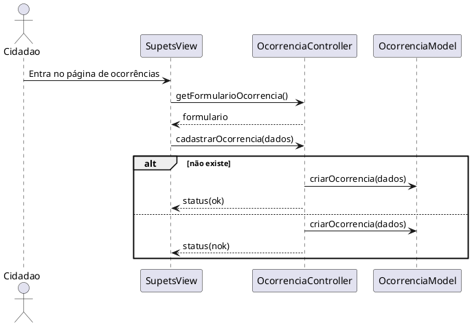

# Diagrama de Sequência

## Registrar ocorrência

```plantuml
@startuml
skinparam Shadowing false

actor Cidadao 

Cidadao -> SupetsView: Entra no página de ocorrências
SupetsView -> OcorrenciaController: getFormularioOcorrencia()
OcorrenciaController --> SupetsView: formulario
SupetsView -> OcorrenciaController: cadastrarOcorrencia(dados)

alt não existe
OcorrenciaController -> OcorrenciaModel: criarOcorrencia(dados)
OcorrenciaController --> SupetsView: status(ok)
else
OcorrenciaController -> OcorrenciaModel: criarOcorrencia(dados)
OcorrenciaController --> SupetsView: status(nok)
end
@enduml

```

## Registrar campanha
