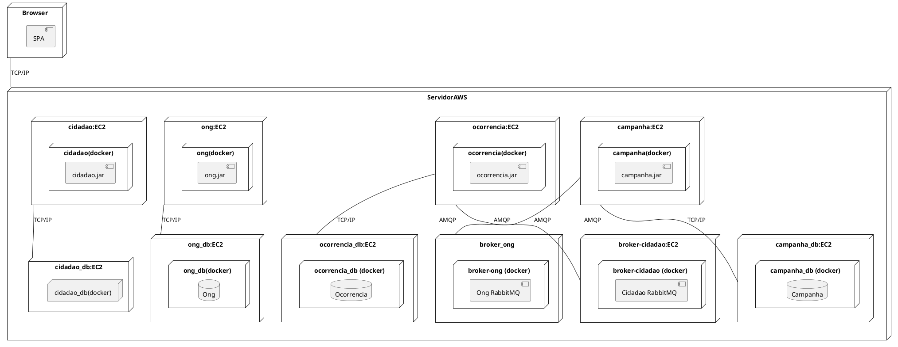

```plantuml
@startuml


node "Browser" as browser {
    [SPA]
}

node "ServidorAWS" as aws {
    node "campanha:EC2" as campanha {
        node "campanha(docker)" {
            [campanha.jar]
        }
    }
    
    node "campanha_db:EC2" as campanha_db {
        node "campanha_db (docker)" {
            database Campanha
        } 
    }
    
    node "broker-cidadao:EC2" as broker_cidadao {
        node "broker-cidadao (docker)" {
            [Cidadao RabbitMQ]
        }
    }
    
    
    campanha -- campanha_db : TCP/IP
    campanha -- broker_ong : AMQP
    campanha -- broker_cidadao : AMQP
    
    
    
    node "ocorrencia:EC2" as ocorrencia {
        node "ocorrencia(docker)" {
            [ocorrencia.jar]
        }
    }
    
    node "ocorrencia_db:EC2" as ocorrencia_db {
        node "ocorrencia_db (docker)" {
            database Ocorrencia
        }
    }
    
    node "broker-ong:EC2" as broker_ong {
        node "broker-ong (docker)" {
            [Ong RabbitMQ]
        }
    }
    
    ocorrencia -- ocorrencia_db : TCP/IP
    ocorrencia -- broker_cidadao : AMQP
    ocorrencia -- broker_ong : AMQP
    
    node "ong_db:EC2" as ong_db {
        node "ong_db(docker)" {
            database Ong
        }
    }
    
    node "ong:EC2" as ong {
        node "ong(docker)" {
            [ong.jar]
        }
    }
    
    ong -- ong_db : TCP/IP
    

    node "cidadao:EC2" as cidadao {
        node "cidadao(docker)" {
            [cidadao.jar]
        }
    }
    
    node "cidadao_db:EC2" as cidadao_db {
        node "cidadao_db(docker)" {
            database Ong
        }
    }
    
    cidadao -- cidadao_db : TCP/IP
    
    browser -- aws : TCP/IP

}

@enduml

```