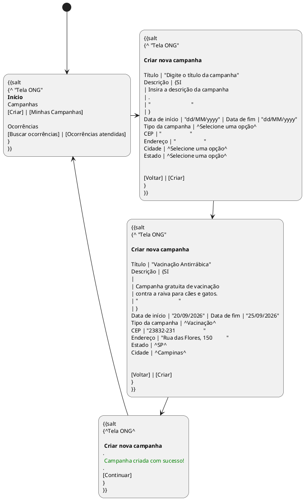

```plantuml
@startuml

(*) --> "
{{salt
{^ "Tela ONG"
<b>Início
Campanhas
[Criar] | [Minhas Campanhas]

Ocorrências
[Buscar ocorrências] | [Ocorrências atendidas]
}
}}
" as inicio

inicio -right-> "
{{salt
{^ "Tela ONG"

<b>Criar nova campanha

Título | "Digite o título da campanha"
Descrição | {SI 
| Insira a descrição da campanha
| .
| "                             "
| }
Data de início | "dd/MM/yyyy" | Data de fim | "dd/MM/yyyy"
Tipo da campanha | ^Selecione uma opção^
CEP | "                    "
Endereço | "                    "
Cidade | ^Selecione uma opção^
Estado | ^Selecione uma opção^


[Voltar] | [Criar]
}
}}
" as vazia

vazia -down-> "
{{salt
{^ "Tela ONG"

<b>Criar nova campanha

Título | "Vacinação Antirrábica"
Descrição | {SI 
| 
| Campanha gratuita de vacinação
| contra a raiva para cães e gatos.
| "                             "
| }
Data de início | "20/09/2026" | Data de fim | "25/09/2026"
Tipo da campanha | ^Vacinação^
CEP | "23832-231                    "
Endereço | "Rua das Flores, 150          "
Estado | ^SP^
Cidade | ^Campinas^


[Voltar] | [Criar]
}
}}
" as preenchida

preenchida -down-> "
{{salt
{^Tela ONG^

<b> Criar nova campanha
.
<color : green> Campanha criada com sucesso!
.
[Continuar]
}
}}
" as sucesso

sucesso --> inicio


@enduml
```