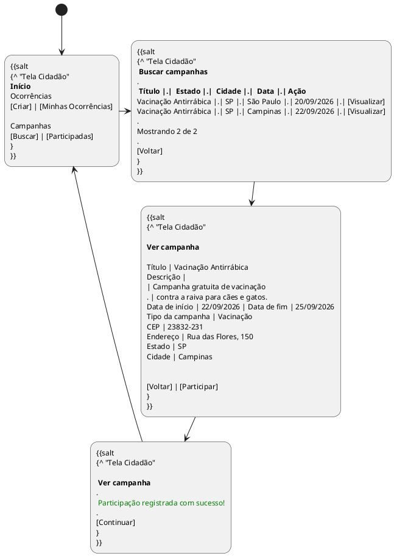

```plantuml
@startuml

(*) --> "
{{salt
{^ "Tela Cidadão"
<b>Início
Ocorrências
[Criar] | [Minhas Ocorrências]

Campanhas
[Buscar] | [Participadas]
}
}}
" as inicio

inicio -right-> "
{{salt
{^ "Tela Cidadão"
<b> Buscar campanhas
.
<b> Título |.| <b> Estado |.| <b> Cidade |.| <b> Data |.| Ação
Vacinação Antirrábica |.| SP |.| São Paulo |.| 20/09/2026 |.| [Visualizar]
Vacinação Antirrábica |.| SP |.| Campinas |.| 22/09/2026 |.| [Visualizar]
.
Mostrando 2 de 2
.
[Voltar]
}
}}
" as lista

lista -down-> "
{{salt
{^ "Tela Cidadão"

<b>Ver campanha

Título | Vacinação Antirrábica
Descrição | 
  | Campanha gratuita de vacinação
. | contra a raiva para cães e gatos.
Data de início | 22/09/2026 | Data de fim | 25/09/2026
Tipo da campanha | Vacinação
CEP | 23832-231
Endereço | Rua das Flores, 150
Estado | SP
Cidade | Campinas


[Voltar] | [Participar]
}
}}
" as preenchida

preenchida -down-> "
{{salt
{^ "Tela Cidadão"

<b> Ver campanha
.
<color : green> Participação registrada com sucesso!
.
[Continuar]
}
}}
" as sucesso

sucesso --> inicio


@enduml
```